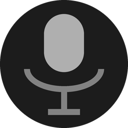
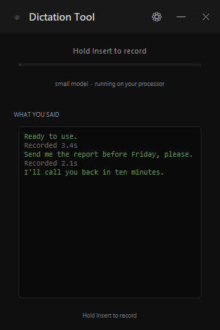
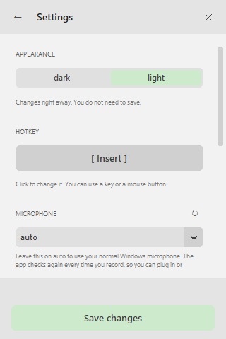

<div align="center">



# Dictation Tool

**Hold a key, speak, and it types for you.**

Free, open source, and it works without internet.



</div>

## What it does

You hold down a key. You talk. You let go. A moment later your words appear in
whatever app you were using — your browser, Word, a chat, anywhere you can type.

It uses [faster-whisper](https://github.com/SYSTRAN/faster-whisper) to turn speech
into text. Everything happens on your own computer. Your voice is never sent
anywhere, and you can unplug the internet and it still works.

## Download

**[Download the installer](https://github.com/bryramirezp/dictation-tool/releases/latest)**
— for Windows 10 and 11.

Run it and you are done. You do not need to install Python or anything else.

> The installer is not signed, so Windows may show a blue box that says
> "Windows protected your PC". Click **More info**, then **Run anyway**.
> Signing costs money every year, which is a lot for a free tool.

The first time you open the app it downloads the speech model, about 460 MB.
This happens once. After that it works offline.

## How to use it

1. Hold **Insert** and speak.
2. Let go. Your words are typed where your cursor is.
3. Click the **⚙** button to change anything.

The app hides near the clock. Click that icon to bring it back.

To start it with Windows, tick the box during install. If you missed it, press
`Win+R`, type `shell:startup`, and drop a shortcut to the app in that folder.

## Settings



| Setting | What it is for |
|---|---|
| **Appearance** | Light or dark. Changes right away. |
| **Hotkey** | The key you hold to record. Extra mouse buttons work too. |
| **Microphone** | Leave it on auto unless you have several and want a specific one. |
| **Language** | Pick the one you speak. This makes the app faster and more accurate. |
| **Device** | Your processor, or your graphics card if you have an NVIDIA one. |
| **Model** | Bigger models are more accurate but slower. |

### About the hotkey

Do not pick a normal letter or number. The app does not block the key, so if you
choose `q`, every `q` you type will start a recording. Good choices are `Insert`,
the `F13`–`F24` keys, or a side button on your mouse.

## Using a graphics card

The installer runs on your processor only. That works, but a large model will be
slow. If you have an NVIDIA graphics card and want the fast version, run it from
the source code instead:

```bat
git clone https://github.com/bryramirezp/dictation-tool.git
cd dictation-tool
py -3 -m pip install -r requirements.txt
py -3 -m pip install nvidia-cublas-cu12 nvidia-cudnn-cu12
launch.bat
```

You need **both** NVIDIA packages. Installing only one will not work. The CUDA
Toolkit you may already have on your computer is not used, so do not worry about
which version it is.

## Running from source

You need Python 3.10 or newer from [python.org](https://www.python.org/downloads/).
Tick "Add python.exe to PATH" while installing it.

```bat
py -3 -m pip install -r requirements.txt
launch.bat
```

`launch.bat` starts the app with no window. To see errors while you work on it,
run `py -3 dictation_tool.py` instead.

If you keep your packages in one specific Python, tell the launcher which one:

```bat
setx DICTATION_PYTHON "C:\Path\To\pythonw.exe"
```

Your settings live in `%LOCALAPPDATA%\DictationTool\settings.json`.

To rebuild the icons after changing the drawing in the app:

```bat
py -3 tools/make_logo.py
```

## Your privacy

- Your voice never leaves your computer.
- The microphone is only on while you hold the key. The rest of the time it is
  closed, so nothing is listening.
- The text is pasted with the clipboard, and whatever you had copied before is
  put back afterwards.

## License

MIT. See [LICENSE](LICENSE).
